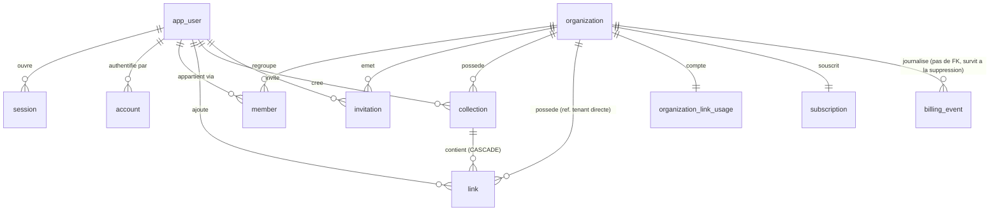

# ERD — Signet

- **Phase** : 2 — architecture
- **Date** : 2026-09-22
- **Socle** : `stack.json` — Postgres, Drizzle, better-auth, Stripe, Inngest
- **Isolation** : `shared-schema-rls` — voir [ADR-0001](ADR/0001-isolation-multitenant.md)
- **Quota Free** : voir [ADR-0002](ADR/0002-quota-free-atomique.md)
- **Token d'invitation** : voir [ADR-0003](ADR/0003-token-invitation-hache.md)

Ce document est la specification de reference du schema. Les migrations Drizzle
(`pnpm db:generate`) couvrent les tables, colonnes, contraintes et index declaratifs ;
les politiques RLS, les triggers et les fonctions `SECURITY DEFINER` sont ecrits a la main
dans des migrations SQL versionnees, dans la meme tranche que la table qu'ils protegent.

---

## 0. Conventions transverses

| Regle | Choix | Raison |
|---|---|---|
| Cle primaire | `uuid` UUIDv7, `DEFAULT uuidv7()` | Ordonne dans le temps (localite d'index) sans exposer de volumetrie ni permettre l'enumeration. Jamais de `serial`. |
| Horodatage | `timestamptz` uniquement | Un `timestamp` sans fuseau est une bombe a retardement ; hebergement UE mais utilisateurs potentiellement ailleurs. |
| Nullabilite | `NOT NULL` par defaut | Chaque colonne nullable de ce document porte une justification d'une ligne. |
| Suppression | Suppression reelle, pas de `deleted_at` | Le PRD n'exige aucune retention (contraintes non fonctionnelles : « aucune politique de retention legale requise »). Un `deleted_at` oublie dans un `WHERE` est une fuite. US-10.3 exige que la collection supprimee « n'apparaisse plus dans aucune consultation » — le `DELETE` reel le garantit sans discipline applicative. |
| Montants | Aucune colonne monetaire dans ce schema | Stripe est la source de verite des montants (US-08, `stack.json`). Si un montant devait etre stocke un jour, ce serait un entier en plus petite unite monetaire (centimes) + code devise ISO-4217, jamais un flottant. |
| Nommage | `snake_case`, tables au singulier | — |
| Texte libre | Toujours borne par un `CHECK char_length(...)` | Une colonne `text` non bornee est un vecteur de saturation trivial. Les bornes retenues sont des valeurs par defaut nommees en §9 (questions ouvertes). |

### Prerequis d'infrastructure

- **Postgres 16** (`stack.json`, decide le 2026-09-22). `uuidv7()` n'est pas une fonction native
  avant Postgres 18 : la migration `0001` **doit** definir `signet.uuidv7()` en PL/pgSQL, et tous
  les `DEFAULT uuidv7()` de ce document pointent en realite vers cette fonction du schema `signet`.
  Ce n'est plus une branche conditionnelle, c'est le chemin unique.
- **better-auth** doit etre configure avec `advanced.database.generateId` produisant un UUIDv7
  (via la meme fonction PL/pgSQL, exposee cote applicatif), sinon les tables qu'il ecrit
  (`app_user`, `session`, `account`, `verification`) recevront des identifiants textuels
  incompatibles avec le type `uuid`.
- **Codes d'erreur applicatifs personnalises.** Au-dela des SQLSTATE standard (`23514` violation
  de `CHECK`, `40001` echec de serialisation), ce schema definit un SQLSTATE de classe utilisateur :
  `SG001` — quota Free depasse a l'ajout d'un lien (§7). La couche d'acces doit le traiter comme
  une erreur metier typee au meme titre que les codes standard, jamais comme un 500.

### Ecarts assumes par rapport aux defauts de better-auth

1. **`user` est renomme `app_user`** (`schema.user.modelName = "app_user"`). `user` est un mot
   reserve SQL : il faudrait le quoter dans chaque migration RLS ecrite a la main. Comme ces
   migrations sont nombreuses et manuelles (ADR-0001), le cout d'un oubli de quote est reel et
   le cout du renommage est d'une ligne de configuration.
2. **La table `invitation` n'est pas celle du plugin organization** : le plugin utilise
   l'identifiant de l'invitation comme secret d'URL, stocke en clair. Voir ADR-0003.
3. Les tables `session`, `account`, `verification` restent telles que better-auth les attend.

---

## 1. Contexte de session et primitives RLS

Le contexte tenant est pose par `SET LOCAL` au debut de chaque transaction, par une connexion
applicative non privilegiee (role `signet_app`, sans `BYPASSRLS`) :

```sql
SET LOCAL app.organization_id = '<uuid de l organisation active>';
SET LOCAL app.user_id         = '<uuid de l utilisateur authentifie>';
```

Deux fonctions `STABLE`, propriete du role proprietaire du schema, servent de base a toutes les
politiques :

```sql
CREATE FUNCTION signet.current_org() RETURNS uuid
  LANGUAGE sql STABLE AS
$$ SELECT nullif(current_setting('app.organization_id', true), '')::uuid $$;

CREATE FUNCTION signet.current_user_id() RETURNS uuid
  LANGUAGE sql STABLE AS
$$ SELECT nullif(current_setting('app.user_id', true), '')::uuid $$;
```

**Fermeture par defaut** : si `SET LOCAL` a ete oublie, `current_org()` retourne `NULL`, toute
comparaison `organization_id = NULL` est `NULL`, donc fausse. La requete ne retourne rien et
l'ecriture est refusee. Un oubli fait echouer, il ne fait pas fuiter.

Chaque table portant de la donnee client recoit :

```sql
ALTER TABLE <t> ENABLE ROW LEVEL SECURITY;
ALTER TABLE <t> FORCE  ROW LEVEL SECURITY;  -- le proprietaire est lui aussi soumis
```

`FORCE` est indispensable : sans lui, le role proprietaire (celui qui joue les migrations, et
potentiellement celui d'un script d'exploitation) contourne silencieusement toutes les politiques.

### Points d'entree `SECURITY DEFINER` (liste fermee)

Certaines operations ont lieu *avant* qu'un contexte tenant puisse exister. Elles sont confinees
a quatre fonctions `SECURITY DEFINER` explicitement listees ici. Toute cinquieme fonction de ce
type est un signal de revue d'architecture, pas un detail d'implementation. S'y ajoutent les
fonctions de trigger `SECURITY DEFINER` internes au schema (compteur de quota §7, invariant
owner §4) : memes regles, memes exigences.

| Fonction | Pourquoi elle ne peut pas vivre sous RLS |
|---|---|
| `signet.create_organization(owner_user_id, org_name)` | US-01.1 : a l'inscription, l'organisation n'existe pas encore, il n'y a pas d'`organization_id` a poser. Cree `organization` + `member` (owner) + `organization_link_usage` + `subscription` (free) en une transaction. |
| `signet.organizations_for_user(user_id)` | Un utilisateur appartient a plusieurs organisations (PRD §unite de compte). Lister ses organisations est le seul besoin legitime de lecture inter-tenant. La fonction force `user_id = signet.current_user_id()` et leve sinon. |
| `signet.lookup_invitation(token_hash)` | L'invite n'est pas encore membre : il n'a aucun contexte tenant. Retourne uniquement le nom de l'organisation, l'e-mail cible et la validite — jamais le contenu de l'organisation. |
| `signet.accept_invitation(token_hash, user_id)` | US-03 : consommation atomique du jeton + creation du `member`, hors contexte tenant. Voir §5. |

**Politique de durcissement (ADR-0002, etendue a toute fonction `SECURITY DEFINER` du schema,
pas seulement au mecanisme de quota qui l'a motivee) :**

1. `SET search_path = pg_catalog, signet, public` explicite sur chaque fonction — jamais le
   `search_path` de session, jamais un schema ecrivible en tete.
2. Chaque fonction appartient au role `signet_definer`, `NOLOGIN`, distinct de `signet_app` et
   `signet_auth`, qui ne detient que les `GRANT` strictement necessaires a ces fonctions (jamais
   de `GRANT` large en `public` ou en propriete du role de migration). `NOLOGIN` interdit toute
   connexion directe sous ce role : il n'est atteignable qu'a travers l'execution d'une fonction
   qu'il possede.
3. Le corps de chaque fonction ne lit et n'ecrit **que** les lignes de l'organisation concernee
   par l'operation en cours (ou, pour `organizations_for_user`, les lignes de l'utilisateur
   appelant lui-meme — seule exception listee, deja bornee par `user_id = current_user_id()`).
   Un `SELECT` ou `UPDATE` sans predicat explicite sur `organization_id` (ou equivalent) est un
   defaut de revue, pas un detail.

Voir ADR-0002 pour le raisonnement complet et le critere de test associe.

---

## 2. Tables d'authentification (hors perimetre tenant)

Ces tables **ne portent pas** d'`organization_id` : un utilisateur existe independamment de toute
organisation et peut en avoir plusieurs. Elles ne sont pas accessibles au role `signet_app` en
contexte tenant ; better-auth s'y connecte avec un role distinct `signet_auth` (privileges limites
a ces quatre tables). C'est une exception assumee a la regle « chaque table reference son tenant » :
il n'existe pas de tenant a referencer, et forcer un `organization_id` ici serait une denormalisation
fausse (US-01.3 : un utilisateur appartient a *au moins* une organisation, pas exactement une).

### 2.1 `app_user`

| Colonne | Type | Contraintes | Note |
|---|---|---|---|
| `id` | `uuid` | PK, `DEFAULT uuidv7()` | |
| `email` | `text` | `NOT NULL`, `CHECK (char_length(email) <= 254)`, `CHECK (email ~ '^[^@[:space:]]+@[^@[:space:]]+\.[^@[:space:]]+$')` | 254 = limite RFC 5321. |
| `email_verified` | `boolean` | `NOT NULL DEFAULT false` | Requis par better-auth. |
| `name` | `text` | `NOT NULL`, `CHECK (char_length(btrim(name)) BETWEEN 1 AND 120)` | Affiche comme auteur d'un lien (US-06.3). |
| `image` | `text` | **NULL autorise** | Avatar optionnel : un utilisateur inscrit par e-mail n'en a pas. |
| `created_at` | `timestamptz` | `NOT NULL DEFAULT now()` | |
| `updated_at` | `timestamptz` | `NOT NULL DEFAULT now()` | |

**Index**
- `UNIQUE INDEX app_user_email_lower_idx ON app_user (lower(email))` — unicite du compte
  insensible a la casse. Index fonctionnel plutot que contrainte `UNIQUE(email)` : sans cela,
  `Alice@x.com` et `alice@x.com` seraient deux comptes, et une invitation adressee a l'un
  n'atteindrait jamais l'autre (US-02.3). C'est aussi l'index de recherche du login.

**RLS** : `ENABLE`/`FORCE`. Le role `signet_app` n'a que le `SELECT`, via la politique :

```sql
CREATE POLICY app_user_visible_to_co_members ON app_user FOR SELECT TO signet_app
USING (EXISTS (SELECT 1 FROM member m
               WHERE m.user_id = app_user.id
                 AND m.organization_id = signet.current_org()));
```

Une seule jointure, sur la table de membership qui porte elle-meme `organization_id`. C'est la
politique minimale qui permet d'afficher l'auteur d'un lien (US-06.3) sans exposer l'annuaire
global des comptes. Le role `signet_auth` a une politique distincte (`USING (true)`) car
l'authentification precede necessairement le contexte tenant.

### 2.2 `session`, `account`, `verification`

Structure imposee par better-auth, reprise sans modification :

- `session(id uuid PK, user_id uuid NOT NULL REFERENCES app_user(id) ON DELETE CASCADE,
  token text NOT NULL UNIQUE, expires_at timestamptz NOT NULL, ip_address text NULL,
  user_agent text NULL, active_organization_id uuid NULL REFERENCES organization(id) ON DELETE SET NULL,
  created_at, updated_at)`
  - `ip_address`, `user_agent` **NULL autorise** : better-auth ne les renseigne pas selon le transport.
  - `active_organization_id` **NULL autorise** : entre la connexion et la selection d'organisation,
    aucune organisation active n'existe. C'est cette colonne qui alimente le `SET LOCAL app.organization_id`.
  - Index : `UNIQUE(token)` (lookup de session a chaque requete), `INDEX (user_id)` (revocation
    de toutes les sessions d'un compte), `INDEX (expires_at)` (purge par Inngest).
- `account(id uuid PK, user_id uuid NOT NULL REFERENCES app_user(id) ON DELETE CASCADE,
  account_id text NOT NULL, provider_id text NOT NULL, password text NULL,
  access_token text NULL, refresh_token text NULL, access_token_expires_at timestamptz NULL,
  refresh_token_expires_at timestamptz NULL, scope text NULL, id_token text NULL, created_at, updated_at)`
  - Toutes les colonnes de jeton sont **NULL autorise** : mutuellement exclusives selon le
    fournisseur (credentials remplit `password`, OAuth remplit les jetons). Le PRD exclut le SSO,
    donc seul le fournisseur `credential` est utilise au MVP — les colonnes OAuth restent car
    better-auth les exige dans son modele.
  - Index : `UNIQUE(provider_id, account_id)` — empeche qu'une meme identite externe soit liee
    a deux comptes. `INDEX (user_id)`.
- `verification(id uuid PK, identifier text NOT NULL, value text NOT NULL,
  expires_at timestamptz NOT NULL, created_at, updated_at)`
  - Index : `INDEX (identifier)`, `INDEX (expires_at)` (purge).

**RLS** : `ENABLE`/`FORCE`, aucune politique pour `signet_app` (donc aucun acces) ; acces reserve
a `signet_auth`. C'est plus sur qu'un `GRANT` retire : meme si un `GRANT` est reaccorde par erreur,
l'absence de politique maintient le refus.

---

## 3. `organization` — racine du tenant

| Colonne | Type | Contraintes | Note |
|---|---|---|---|
| `id` | `uuid` | PK, `DEFAULT uuidv7()` | **C'est l'`organization_id` reference partout.** |
| `name` | `text` | `NOT NULL`, `CHECK (char_length(btrim(name)) BETWEEN 1 AND 120)` | US-01.2. |
| `slug` | `text` | `NOT NULL`, `CHECK (slug ~ '^[a-z0-9]+(-[a-z0-9]+)*$' AND char_length(slug) BETWEEN 2 AND 60)` | Requis par le plugin organization de better-auth. |
| `created_at` | `timestamptz` | `NOT NULL DEFAULT now()` | |
| `updated_at` | `timestamptz` | `NOT NULL DEFAULT now()` | |

**Index**
- `UNIQUE INDEX organization_slug_idx ON organization (slug)` — le slug apparait dans les URL,
  il doit etre unique globalement. Unicite globale et non par tenant : c'est la seule colonne du
  schema dont l'espace de noms est partage entre organisations.
- `UNIQUE INDEX organization_id_self_idx ON organization (id)` est implicite (PK).

**RLS**

```sql
CREATE POLICY organization_isolation ON organization TO signet_app
USING (id = signet.current_org())
WITH CHECK (id = signet.current_org());
```

L'`INSERT` d'une organisation passe exclusivement par `signet.create_organization()` (§1), la
politique `WITH CHECK` refusant par construction une insertion sans contexte tenant prealable.

**Trigger** : `AFTER INSERT` → cree la ligne `organization_link_usage` et la ligne `subscription`
correspondantes. Ainsi aucune organisation ne peut exister sans compteur de quota ni sans palier :
l'invariant est garanti par la base, pas par l'ordre des appels applicatifs.

---

## 4. `member` — appartenance et role

| Colonne | Type | Contraintes | Note |
|---|---|---|---|
| `id` | `uuid` | PK, `DEFAULT uuidv7()` | |
| `organization_id` | `uuid` | `NOT NULL REFERENCES organization(id) ON DELETE CASCADE` | Reference tenant directe. |
| `user_id` | `uuid` | `NOT NULL REFERENCES app_user(id) ON DELETE CASCADE` | |
| `role` | `text` | `NOT NULL CHECK (role IN ('owner','member'))` | Les deux seuls roles du PRD. Un `CHECK` plutot qu'un `enum` Postgres : ajouter une valeur a un `enum` est une migration non transactionnelle sur certaines versions, alors que modifier un `CHECK` est trivial. |
| `created_at` | `timestamptz` | `NOT NULL DEFAULT now()` | |

**Index**
- `UNIQUE INDEX member_org_user_idx ON member (organization_id, user_id)` — un utilisateur a
  **un seul** role par organisation (PRD : « un role par organisation »). Cet index sert aussi le
  controle d'autorisation, requete la plus frequente de l'application.
- `INDEX member_user_idx ON member (user_id)` — sert `signet.organizations_for_user()` et la
  revocation d'acces. Sans lui, lister les organisations d'un utilisateur est un scan complet.
- `UNIQUE INDEX member_single_owner_idx ON member (organization_id) WHERE role = 'owner'` —
  **decision du 2026-09-22** : une organisation a exactement un owner, jamais deux. L'index
  partiel n'est plus seulement une optimisation de la verification US-04.3, il porte l'invariant
  « au plus un owner » au niveau base. Sert aussi le controle d'autorisation de `subscription`
  et `billing_event` (§8).

**RLS** : `USING`/`WITH CHECK (organization_id = signet.current_org())`.

**Owner unique et immuable (decision du 2026-09-22).** Le PRD suppose un seul owner par
organisation ; le transfert de propriete (promotion d'un member, retrogradation de l'owner) est
explicitement hors perimetre du MVP. Consequences directes sur le schema :

- `member_single_owner_idx` (ci-dessus) rend une deuxieme ligne `role = 'owner'` impossible.
- Aucune route d'API ne modifie `member.role` apres creation (voir contrats d'API) : l'owner est
  fixe une fois pour toutes par `signet.create_organization()`, les invites arrivent toujours en
  `member` (`invitation.role CHECK (role = 'member')`, §5).
- **L'owner ne peut donc jamais quitter son organisation ni en etre retire** (US-04.3 : « le
  dernier owner ne peut ni se retirer lui-meme, ni etre retire »), et il n'existe aucun mecanisme
  de sortie. C'est un choix produit assume, pas un oubli : `signet.create_organization()` est le
  seul chemin qui cree une ligne `owner`, et il n'y a symetriquement aucun chemin qui en supprime
  la derniere.

L'invariant « au moins un owner » reste porte par un **constraint trigger differe**, restreint au
seul `DELETE` puisque `role` n'est jamais modifie par une route applicative dans ce MVP :

```sql
CREATE CONSTRAINT TRIGGER member_keep_last_owner
AFTER DELETE ON member
DEFERRABLE INITIALLY DEFERRED
FOR EACH ROW EXECUTE FUNCTION signet.assert_owner_remains();
```

`signet.assert_owner_remains()` (`SECURITY DEFINER`, role `signet_definer`, `search_path` fixe,
lecture bornee a `organization_id = OLD.organization_id` — politique ADR-0002) : si l'organisation
existe encore **et** qu'aucune ligne `member` de role `owner` n'y subsiste, elle leve. Le garde
`DEFERRABLE INITIALLY DEFERRED` reste necessaire pour un seul cas : lors d'un `DELETE`
d'organisation, la cascade supprime tous les `member` avant que le trigger ne s'execute ; la
fonction teste donc d'abord que l'organisation existe encore avant de conclure a une violation,
sinon toute suppression d'organisation echouerait.

Si une tranche future introduit un transfert de propriete, cette section (trigger, index,
contrainte sur `invitation.role`) doit etre rouverte ensemble — un `UPDATE OF role` non couvert
par le trigger romprait l'invariant en silence.

---

## 5. `invitation`

Voir [ADR-0003](ADR/0003-token-invitation-hache.md) pour le choix de stockage du jeton.

| Colonne | Type | Contraintes | Note |
|---|---|---|---|
| `id` | `uuid` | PK, `DEFAULT uuidv7()` | **N'est jamais le secret d'URL.** |
| `organization_id` | `uuid` | `NOT NULL REFERENCES organization(id) ON DELETE CASCADE` | US-02.1 : l'invitation est liee a l'organisation. |
| `email` | `text` | `NOT NULL`, `CHECK (email = lower(email))`, `CHECK (char_length(email) <= 254)`, memes regles de forme que `app_user.email` | Stockee en minuscules pour que l'unicite et le rapprochement de compte soient deterministes sans extension `citext`. |
| `role` | `text` | `NOT NULL DEFAULT 'member' CHECK (role = 'member')` | **Decide le 2026-09-22** : inviter un owner est impossible, une invitation cree toujours un `member` — coherent avec l'owner unique et immuable (§4). Le `CHECK` n'est plus une valeur par defaut a confirmer, c'est la regle. |
| `token_hash` | `bytea` | `NOT NULL`, `CHECK (octet_length(token_hash) = 32)` | SHA-256 du secret d'URL. Le secret en clair n'est jamais ecrit en base. |
| `invited_by_user_id` | `uuid` | `NOT NULL REFERENCES app_user(id) ON DELETE RESTRICT` | Tracabilite : qui a ouvert l'acces. `RESTRICT` — voir §9 (suppression de compte). |
| `created_at` | `timestamptz` | `NOT NULL DEFAULT now()` | |
| `expires_at` | `timestamptz` | `NOT NULL DEFAULT (now() + interval '7 days')`, `CHECK (expires_at > created_at)`, `CHECK (expires_at <= created_at + interval '7 days')` | US-02.1 : les 7 jours sont dans la base, pas dans une constante applicative qui derive. Le second `CHECK` fait du delai un **maximum** impose : aucun appelant ne peut fabriquer une invitation a duree illimitee. |
| `accepted_at` | `timestamptz` | **NULL autorise** | `NULL` = invitation non encore consommee. C'est l'etat, pas une colonne de statut redondante. |
| `accepted_by_user_id` | `uuid` | **NULL autorise**, `REFERENCES app_user(id) ON DELETE RESTRICT` | `NULL` tant que l'invitation n'est pas acceptee. |

**Contrainte de coherence**
```sql
CONSTRAINT invitation_acceptance_consistent
  CHECK ((accepted_at IS NULL) = (accepted_by_user_id IS NULL))
```
Les deux colonnes sont renseignees ensemble ou pas du tout : un etat « acceptee par personne »
est impossible.

**Pas de colonne `status`.** Les trois etats de US-03 sont derives, donc jamais desynchronises :
- en attente : `accepted_at IS NULL AND expires_at > now()`
- expiree : `accepted_at IS NULL AND expires_at <= now()`
- deja utilisee : `accepted_at IS NOT NULL`

Une colonne `status = 'expired'` aurait exige un job de maintenance ; le jour ou ce job echoue,
une invitation expiree redevient acceptable. L'etat derive n'a pas ce mode de defaillance.

**Index**
- `UNIQUE INDEX invitation_token_hash_idx ON invitation (token_hash)` — index de lookup du flux
  d'acceptation (seul chemin d'acces) et garantie qu'une collision de jeton est impossible.
- `UNIQUE INDEX invitation_pending_idx ON invitation (organization_id, email) WHERE accepted_at IS NULL`
  — **index unique partiel**, **decide le 2026-09-22** : au plus une invitation non consommee par
  couple (organisation, e-mail) ; une tentative de doublon retourne 409 (US-02, contrat d'API).
  Le predicat ne peut pas inclure `expires_at > now()` : `now()` n'est pas immutable, donc
  inutilisable dans un index partiel — voir la fonction `create_invitation` ci-dessous pour
  la consequence de cette limite.
- `INDEX invitation_org_idx ON invitation (organization_id)` — liste des invitations en attente
  d'une organisation.
- `INDEX invitation_expires_idx ON invitation (expires_at) WHERE accepted_at IS NULL` — purge
  periodique par Inngest des invitations perimees.

**RLS** : `USING`/`WITH CHECK (organization_id = signet.current_org())`. La lecture par jeton se
fait hors contexte tenant via `signet.lookup_invitation()`, qui ne divulgue que le nom de
l'organisation et l'e-mail cible.

**Emission (US-02.1) — `signet.create_invitation(organization_id, email, invited_by_user_id)`.**
Decision du 2026-09-22 : une invitation en attente et non expiree pour (organisation, e-mail)
retourne 409 ; une fois expiree, une nouvelle invitation est permise, **sans action manuelle**.
Comme l'index partiel ne peut pas exclure les lignes expirees de son predicat, la fonction fait
le tri elle-meme, dans la transaction qui cree la nouvelle invitation :

```sql
DELETE FROM invitation
 WHERE organization_id = p_organization_id
   AND email = p_email
   AND accepted_at IS NULL
   AND expires_at <= now();               -- purge la ligne perimee, s'il y en a une

INSERT INTO invitation (organization_id, email, invited_by_user_id, token_hash, ...)
VALUES (...);                             -- leve une violation d'unicite si une ligne
                                           -- ENCORE VALIDE existe (accepted_at IS NULL,
                                           -- expires_at > now()) : c'est le 409.
```

Le `DELETE` ne retire que des lignes deja mortes fonctionnellement (expirees, jamais acceptees) ;
il ne contourne jamais le refus d'un doublon reellement actif, qui reste porte par l'index unique.
**Pas de `SECURITY DEFINER` ici** : l'appelant (owner) est deja dans un contexte tenant valide
(session authentifiee, `SET LOCAL app.organization_id`), la RLS ordinaire de `invitation`
(`organization_id = current_org()`) s'applique normalement sous le role `signet_app`. Ajouter
cette fonction a la liste fermee des points d'entree pre-tenant serait une escalade de privilege
non justifiee — elle n'en fait pas partie.

**Consommation atomique a usage unique (US-03.3)** — `signet.accept_invitation()` :

```sql
UPDATE invitation
   SET accepted_at = now(), accepted_by_user_id = p_user_id
 WHERE token_hash = p_token_hash
   AND accepted_at IS NULL
   AND expires_at > now()
RETURNING organization_id, email;
```

Un seul enonce. Deux clics concurrents sur le meme lien : le premier verrouille la ligne, le
second attend puis re-evalue le predicat sur la ligne mise a jour (`READ COMMITTED`), voit
`accepted_at IS NOT NULL` et ne retourne aucune ligne. La fonction leve alors une erreur typee
et **aucun `member` n'est cree** — exactement US-03.3. Aucune lecture prealable, donc aucune
fenetre entre verification et ecriture. L'insertion du `member` a lieu dans la meme transaction,
apres le `RETURNING`.

---

## 6. `collection` et `link`

### 6.1 `collection`

| Colonne | Type | Contraintes | Note |
|---|---|---|---|
| `id` | `uuid` | PK, `DEFAULT uuidv7()` | |
| `organization_id` | `uuid` | `NOT NULL REFERENCES organization(id) ON DELETE CASCADE` | US-05.2. |
| `name` | `text` | `NOT NULL`, `CHECK (char_length(btrim(name)) BETWEEN 1 AND 100)`, `CHECK (name = btrim(name))` | Le `btrim` impose empeche `"Veille "` et `"Veille"` de coexister en contournant l'unicite par un espace invisible. |
| `created_by_user_id` | `uuid` | `NOT NULL REFERENCES app_user(id) ON DELETE RESTRICT` | |
| `created_at` | `timestamptz` | `NOT NULL DEFAULT now()` | |

**Contraintes**
- `UNIQUE (id, organization_id)` — contrainte apparemment redondante avec la PK, mais
  **indispensable** : elle est la cible de la cle etrangere composite de `link` (§6.2) qui rend
  la denormalisation d'`organization_id` incorruptible.

**Index**
- `UNIQUE INDEX collection_org_name_ci_idx ON collection (organization_id, lower(btrim(name)))`
  — US-05.3, **decide le 2026-09-22** : unicite **par organisation**, jamais globale, et
  **insensible a la casse** (`Veille` et `veille` sont le meme nom). Index fonctionnel plutot que
  `UNIQUE (organization_id, name)` : c'est `lower(name)` qui doit etre unique, pas `name`
  lui-meme. Le `btrim` dans l'index est redondant avec le `CHECK (name = btrim(name))` ci-dessus
  mais rend l'index correct par construction, independamment de cette contrainte. Sert aussi la
  liste des collections d'une organisation triee par nom : aucun index supplementaire n'est
  necessaire.

**RLS** : `USING`/`WITH CHECK (organization_id = signet.current_org())`.
US-09.2 (404 et non 403 sur une ressource d'une autre organisation) tombe naturellement : la ligne
est invisible, la requete retourne zero ligne, la couche applicative traduit en 404 sans avoir a
distinguer « inexistant » de « interdit ».

### 6.2 `link`

| Colonne | Type | Contraintes | Note |
|---|---|---|---|
| `id` | `uuid` | PK, `DEFAULT uuidv7()` | |
| `organization_id` | `uuid` | `NOT NULL` | Reference tenant **directe**, exigee par ADR-0001 : sans elle, la politique RLS de `link` devrait joindre `collection`. |
| `collection_id` | `uuid` | `NOT NULL` | |
| `url` | `text` | `NOT NULL`, `CHECK (url ~ '^https?://[^[:space:]]+$')`, `CHECK (char_length(url) BETWEEN 8 AND 2048)` | US-06.2 : la validation de forme existe aussi cote applicatif (schema de validation, regle `CLAUDE.md`) mais le filet final est en base. 2048 = limite pratique des navigateurs. |
| `title` | `text` | `NOT NULL`, `CHECK (char_length(btrim(title)) BETWEEN 1 AND 200)` | US-06.1. |
| `added_by_user_id` | `uuid` | `NOT NULL REFERENCES app_user(id) ON DELETE RESTRICT` | US-06.3 : l'auteur. `RESTRICT` et non `CASCADE` : le retrait d'un membre (US-04) supprime sa ligne `member`, pas son compte — les liens qu'il a ajoutes restent a l'organisation. |
| `created_at` | `timestamptz` | `NOT NULL DEFAULT now()` | US-06.3 : la date d'ajout. Cle de tri de US-07.2. |

**Cle etrangere composite — le point central de cette table**

```sql
CONSTRAINT link_collection_fk
  FOREIGN KEY (collection_id, organization_id)
  REFERENCES collection (id, organization_id)
  ON DELETE CASCADE
```

Une seule cle etrangere resout deux problemes a la fois :

1. **US-10.1 — cascade reelle** : supprimer une collection supprime ses liens dans la meme
   operation, au niveau base. Aucune boucle applicative, aucune transaction a orchestrer, aucun
   risque de suppression partielle sur interruption.
2. **La denormalisation d'`organization_id` ne peut pas deriver** : il est physiquement impossible
   d'inserer un lien dont l'`organization_id` differe de celui de sa collection, ou de deplacer
   une collection d'organisation en laissant ses liens derriere. C'est ce qui rend la
   denormalisation exigee par ADR-0001 sure : sans cette cle composite, `link.organization_id`
   serait une copie que rien ne garde honnete, et la politique RLS de `link` deviendrait une
   affirmation non verifiee.

`organization_id` porte en plus `REFERENCES organization(id) ON DELETE CASCADE`, pour que la
suppression d'une organisation efface ses liens meme si la collection est supprimee dans le meme
enonce.

**Index**
- `INDEX link_collection_recent_idx ON link (collection_id, created_at DESC, id DESC)` — sert
  exactement US-07.2 (liste d'une collection, du plus recent au plus ancien) sans tri en memoire.
  `id DESC` en departage : deux liens ajoutes dans la meme milliseconde auraient sinon un ordre
  instable d'une page a l'autre, et l'UUIDv7 etant ordonne dans le temps, il departage dans le
  bon sens. Cet index porte aussi la cascade de suppression de la collection.
- `INDEX link_org_idx ON link (organization_id)` — sert la cascade de suppression d'organisation
  et la recompilation du compteur de quota (§7, procedure de reconciliation).
- `INDEX link_author_idx ON link (added_by_user_id)` — sert la contrainte `RESTRICT` sur
  `app_user` ; sans lui, toute tentative de suppression de compte declenche un scan complet.
  Postgres n'indexe pas automatiquement les cles etrangeres.

**RLS** : `USING`/`WITH CHECK (organization_id = signet.current_org())`. Zero jointure.

**Pas de suppression unitaire d'un lien** : le PRD l'exclut explicitement (hors-perimetre). Le
`DELETE` sur `link` n'est donc expose par aucun chemin applicatif, mais le trigger de decompte
(§7) le gere correctement afin que la cascade de US-10 maintienne le compteur juste.

---

## 7. `organization_link_usage` — compteur de quota

Voir [ADR-0002](ADR/0002-quota-free-atomique.md). Cette table est le mecanisme qui repond au
risque #3 du PRD.

| Colonne | Type | Contraintes | Note |
|---|---|---|---|
| `organization_id` | `uuid` | **PK**, `REFERENCES organization(id) ON DELETE CASCADE` | La PK *est* la reference tenant : une ligne par organisation, exactement. |
| `link_count` | `integer` | `NOT NULL DEFAULT 0`, `CHECK (link_count >= 0)` | Nombre de liens de l'organisation, toutes collections confondues. |
| `link_quota` | `integer` | **NULL autorise**, `CHECK (link_quota IS NULL OR link_quota > 0)` | `NULL` = illimite (palier Pro). Une valeur sentinelle (`2147483647`) aurait evite le `NULL` au prix d'un nombre magique qui finit toujours par etre compare litteralement quelque part. |
| `updated_at` | `timestamptz` | `NOT NULL DEFAULT now()` | |

**Le quota s'applique au flux, pas au stock (decide le 2026-09-22)**

Contrairement a la version initiale de cet ERD, il n'existe **aucune contrainte `CHECK`** reliant
`link_count` et `link_quota` sur cette table. Raison : une retrogradation Pro → Free d'une
organisation comptant plus de 50 liens doit **reussir** (les liens existants restent, lisibles,
jamais supprimes) ; seule une **tentative d'ajout** au-dela du plafond doit etre refusee (US-06.4).
Une contrainte statique sur la ligne ne peut pas exprimer cette asymetrie — elle bloquerait aussi
bien l'ajout que la simple ecriture d'un `link_quota` plus bas que `link_count` courant, ce qui
casserait le passage de palier. L'application se fait donc **de facon procedurale, uniquement
dans la branche `INSERT` du trigger sur `link`** ci-dessous ; la branche `DELETE` et la
propagation du plafond depuis `subscription` (§8.1) restent inconditionnelles.

**Triggers**

```sql
-- AFTER INSERT FOR EACH ROW ON link, SECURITY DEFINER
UPDATE organization_link_usage
   SET link_count = link_count + 1, updated_at = now()
 WHERE organization_id = NEW.organization_id
RETURNING link_count, link_quota INTO v_count, v_quota;    -- leve si ROW_COUNT <> 1

IF v_quota IS NOT NULL AND v_count > v_quota THEN
  RAISE EXCEPTION 'free tier quota exceeded for organization %', NEW.organization_id
    USING ERRCODE = 'SG001';                               -- rollback de l'INSERT declencheur
END IF;
```
```sql
-- AFTER DELETE FOR EACH ROW ON link, SECURITY DEFINER — inconditionnel, pas de verification de quota
UPDATE organization_link_usage
   SET link_count = link_count - 1, updated_at = now()
 WHERE organization_id = OLD.organization_id;               -- tolerant a ROW_COUNT = 0
```

- La branche `INSERT` **leve** (`ERRCODE SG001`, code applicatif personnalise — §0) si le nouveau
  compteur depasse le plafond, et **leve aussi** si aucune ligne n'a ete mise a jour du tout : une
  organisation sans compteur est un bug, pas un cas a absorber silencieusement.
- La branche `DELETE` est **tolerante et inconditionnelle** : lors d'un `DELETE` d'organisation,
  l'ordre des cascades entre `link` et `organization_link_usage` n'est pas garanti par Postgres ;
  si la ligne de compteur est deja partie, il n'y a rien a decrementer. Elle ne verifie jamais le
  quota, une suppression fait toujours baisser le compteur.
- `SECURITY DEFINER`, role `signet_definer`, `search_path` fixe, lecture et ecriture bornees a
  `organization_id = NEW.organization_id` / `OLD.organization_id` (politique ADR-0002) : combine
  a `REVOKE INSERT, UPDATE, DELETE ON organization_link_usage FROM signet_app`, cela rend le
  compteur modifiable **uniquement** par l'insertion ou la suppression effective d'un lien. Une
  requete applicative ne peut pas le desaligner, meme par erreur. Le role `signet_app` conserve le
  `SELECT` (via politique RLS `organization_id = current_org()`) pour afficher « 32 / 50 » a tous
  les membres — sans leur donner acces a la table `subscription`, reservee aux owners (US-08.2).

**Pourquoi c'est atomique** — scenario du risque #3, deux ajouts concurrents a 49 liens, quota 50 :

| | Transaction A | Transaction B |
|---|---|---|
| t1 | `INSERT link` → trigger `UPDATE usage` → verrou de ligne, `link_count = 50`, `50 <= 50` OK | |
| t2 | | `INSERT link` → trigger `UPDATE usage` → **bloque sur le verrou de ligne** |
| t3 | `COMMIT` | |
| t4 | | Reveil, re-evaluation de la ligne validee : `49 → 50`, puis `50 + 1 = 51` |
| t5 | | `51 > 50` → `RAISE EXCEPTION ... ERRCODE 'SG001'` → **transaction annulee, aucun lien cree** |

Le verrou de ligne serialise les ajouts d'une meme organisation ; il n'y a aucune fenetre entre
lecture et ecriture puisqu'il n'y a pas de lecture. En `REPEATABLE READ`/`SERIALIZABLE`, B recoit
une erreur de serialisation (`40001`) au lieu de `SG001` : les deux mènent a l'annulation, et les
deux doivent etre traduits en erreur metier typee (`QuotaExceeded`), jamais en 500. Deplacer la
verification de la declarativite (`CHECK`) vers une exception explicite ne change rien a cette
propriete : c'est toujours le meme verrou de ligne, pris au meme instant, qui serialise les deux
transactions — seul le moment ou l'echec est signale (apres un `IF` plutot qu'apres un `CHECK`)
change, precisement pour ne plus s'appliquer a la propagation du plafond depuis `subscription`.

**Reconciliation** — une procedure `signet.recompute_link_usage(org_id)` recalcule `link_count`
depuis `link`. Elle n'est pas appelee en fonctionnement normal ; elle existe pour qu'un doute sur
le compteur se resolve par une commande plutot que par un `UPDATE` improvise en production. Un
test d'integration doit verifier apres chaque scenario que `link_count = count(*)`.

**Index** : aucun au-dela de la PK. La table est accedee exclusivement par `organization_id`.

---

## 8. Abonnement et journal facturable

### 8.1 `subscription` — etat courant du palier

Une ligne par organisation, exactement. Table separee de `organization` pour une raison
d'autorisation et non de normalisation : **US-08.2 exige qu'un member ne puisse ni consulter ni
modifier l'abonnement**. Isoler les donnees de facturation dans leur propre table permet
d'exprimer cette regle en RLS, donc en base, plutot qu'en garde applicative.

| Colonne | Type | Contraintes | Note |
|---|---|---|---|
| `organization_id` | `uuid` | **PK**, `REFERENCES organization(id) ON DELETE CASCADE` | La PK impose l'unicite : une organisation a un palier, pas deux. |
| `tier` | `text` | `NOT NULL DEFAULT 'free' CHECK (tier IN ('free','pro'))` | Les deux paliers du PRD. |
| `status` | `text` | `NOT NULL DEFAULT 'active' CHECK (status IN ('active','past_due','canceled','incomplete'))` | Reflet du statut Stripe. Distinct de `tier` : un abonnement Pro `past_due` reste Pro tant que Stripe ne l'a pas resilie. |
| `stripe_customer_id` | `text` | **NULL autorise**, `CHECK (char_length(...) <= 255)` | `NULL` tant que l'organisation n'a jamais atteint le tunnel de paiement (cas nominal d'une organisation Free). |
| `stripe_subscription_id` | `text` | **NULL autorise** | `NULL` sur le palier Free : il n'existe aucun abonnement Stripe. |
| `current_period_end` | `timestamptz` | **NULL autorise** | `NULL` sur Free : aucune periode de facturation. |
| `cancel_at_period_end` | `boolean` | `NOT NULL DEFAULT false` | Annulation programmee (Stripe). |
| `created_at` | `timestamptz` | `NOT NULL DEFAULT now()` | |
| `updated_at` | `timestamptz` | `NOT NULL DEFAULT now()` | |

**Contraintes**
```sql
CONSTRAINT subscription_pro_is_backed
  CHECK (tier <> 'pro' OR stripe_subscription_id IS NOT NULL)
```
Une organisation sur Pro sans abonnement Stripe en face est le bug le plus couteux possible
(liens illimites, personne ne paie) et le plus silencieux : rien dans l'interface ne le signale.
La base le rend impossible.

```sql
CONSTRAINT subscription_free_has_no_period
  CHECK (tier <> 'free' OR current_period_end IS NULL)
```

**Index**
- `UNIQUE INDEX subscription_stripe_sub_idx ON subscription (stripe_subscription_id)
   WHERE stripe_subscription_id IS NOT NULL` — index unique **partiel** : un abonnement Stripe
  ne peut pas etre rattache a deux organisations (ce serait une confusion de facturation entre
  tenants), mais les lignes Free, toutes a `NULL`, ne se genent pas. C'est aussi l'index de lookup
  du webhook Stripe, qui arrive avec un identifiant Stripe et rien d'autre.
- `UNIQUE INDEX subscription_stripe_customer_idx ON subscription (stripe_customer_id)
   WHERE stripe_customer_id IS NOT NULL` — meme raisonnement pour le client Stripe.

**RLS — owner uniquement**
```sql
CREATE POLICY subscription_owner_only ON subscription TO signet_app
USING (organization_id = signet.current_org()
       AND EXISTS (SELECT 1 FROM member m
                   WHERE m.organization_id = signet.current_org()
                     AND m.user_id = signet.current_user_id()
                     AND m.role = 'owner'))
WITH CHECK (same);
```
Une jointure unique, sur `member`, servie par l'index partiel `member_single_owner_idx`. US-08.2 devient
une propriete de la base : meme une route qui oublierait le controle de role ne verra rien.
Le webhook Stripe, lui, n'a pas d'utilisateur : il ecrit via une fonction dediee du role
proprietaire, apres verification de signature (et non via `signet_app`).

**Trigger de propagation du quota** — `AFTER INSERT OR UPDATE OF tier ON subscription`,
`SECURITY DEFINER`, role `signet_definer`, `search_path` fixe, lecture/ecriture bornees a
`organization_id = NEW.organization_id` (politique ADR-0002) :
```sql
UPDATE organization_link_usage
   SET link_quota = signet.quota_for_tier(NEW.tier), updated_at = now()
 WHERE organization_id = NEW.organization_id;
```
`signet.quota_for_tier(text)` (`IMMUTABLE`) est **l'unique endroit** ou la valeur 50 existe :
`free → 50`, `pro → NULL`. Le palier et le plafond ne peuvent pas diverger.

**Decide le 2026-09-22** : cette ecriture est **inconditionnelle**, y compris quand elle abaisse
le plafond en dessous du compteur courant (`link_count` = 75, nouveau `link_quota` = 50). Depuis
que le quota s'applique au flux et non au stock (§7 : plus de `CHECK` reliant `link_count` et
`link_quota` sur `organization_link_usage`), rien n'empeche cette `UPDATE` de reussir. La
retrogradation Pro → Free est donc **toujours acceptee** : les 75 liens existants restent en
place et consultables, et le quota ne redevient contraignant qu'a la prochaine tentative d'ajout
(§7, `ERRCODE SG001`) tant que l'organisation reste au-dessus de 50. Aucune suppression, aucun
gel retroactif — le refus ne porte que sur le flux futur.

### 8.2 `billing_event` — journal append-only

US-08.3 : « source de verite auditable ». Une table qu'on peut modifier n'est pas auditable.

| Colonne | Type | Contraintes | Note |
|---|---|---|---|
| `id` | `uuid` | PK, `DEFAULT uuidv7()` | Ordonne dans le temps par construction. |
| `organization_id` | `uuid` | `NOT NULL` — **pas de `REFERENCES`** | **Decide le 2026-09-22** : `billing_event` survit a la suppression de son organisation, l'identifiant est conserve comme une simple valeur historique, pas comme cle etrangere active. La source de verite auditable (US-08.3) l'emporte sur « les donnees d'une organisation sont supprimees si l'organisation est supprimee » (contraintes non fonctionnelles du PRD) : cette derniere regle s'applique aux donnees operationnelles de l'organisation, pas a son historique de facturation. Consequence acceptee : plus aucune ligne `member` n'existe pour verifier un role `owner` une fois l'organisation supprimee, donc la politique RLS ci-dessous ne peut plus etre satisfaite par aucune session `signet_app` — ces lignes restent en base mais deviennent inaccessibles par l'application normale, lisibles seulement par un role d'audit privilegie hors RLS. C'est le comportement voulu : un historique qui reste accessible **a l'application courante** apres suppression de l'organisation ne serait pas vraiment un historique isole. |
| `type` | `text` | `NOT NULL CHECK (type IN ('subscription_started','tier_changed','subscription_canceled'))` | Exactement les trois evenements facturables du PRD, ni plus ni moins. |
| `from_tier` | `text` | **NULL autorise**, `CHECK (from_tier IS NULL OR from_tier IN ('free','pro'))` | `NULL` pour `subscription_started` : il n'y a pas d'etat anterieur. |
| `to_tier` | `text` | **NULL autorise**, `CHECK (to_tier IS NULL OR to_tier IN ('free','pro'))` | `NULL` pour `subscription_canceled` : il n'y a pas d'etat posterieur facture. |
| `actor_user_id` | `uuid` | **NULL autorise**, `REFERENCES app_user(id) ON DELETE SET NULL` | `NULL` quand l'evenement provient de Stripe sans action utilisateur (echec de paiement, resiliation automatique). `SET NULL` et non `RESTRICT` : la suppression d'un compte ne doit pas effacer ni bloquer une ligne d'audit — l'evenement reste, son acteur devient inconnu. |
| `stripe_event_id` | `text` | **NULL autorise** | `NULL` pour un evenement d'origine interne. Cle d'idempotence des webhooks. |
| `occurred_at` | `timestamptz` | `NOT NULL` | Date de l'evenement **selon Stripe**. |
| `recorded_at` | `timestamptz` | `NOT NULL DEFAULT now()` | Date d'enregistrement local. Distinguer les deux est indispensable : un webhook rejoue trois jours plus tard ne doit pas reecrire l'histoire. |

**Contraintes de coherence par type**
```sql
CONSTRAINT billing_event_shape CHECK (
  (type = 'subscription_started'  AND from_tier IS NULL     AND to_tier IS NOT NULL) OR
  (type = 'tier_changed'          AND from_tier IS NOT NULL AND to_tier IS NOT NULL
                                  AND from_tier <> to_tier)                          OR
  (type = 'subscription_canceled' AND from_tier IS NOT NULL AND to_tier IS NULL)
)
```
Un `tier_changed` de `pro` vers `pro` est un non-evenement ; la base le refuse plutot que de
laisser un rapport d'audit le compter.

**Index**
- `INDEX billing_event_org_time_idx ON billing_event (organization_id, occurred_at DESC, id DESC)`
  — la seule lecture prevue : l'historique d'une organisation, du plus recent au plus ancien.
- `UNIQUE INDEX billing_event_stripe_idx ON billing_event (stripe_event_id)
   WHERE stripe_event_id IS NOT NULL` — index unique **partiel** : Stripe garantit « au moins une »
  livraison, pas « exactement une ». Cet index transforme l'idempotence des webhooks en propriete
  de la base : un rejeu produit une violation d'unicite, que le handler traite comme un succes.
  Sans lui, l'idempotence dependrait d'une verification applicative, elle-meme sujette au meme
  probleme de concurrence que le quota (risque #3).

**Append-only, garanti en base**
```sql
REVOKE UPDATE, DELETE ON billing_event FROM signet_app;
CREATE TRIGGER billing_event_immutable
BEFORE UPDATE OR DELETE ON billing_event
FOR EACH ROW EXECUTE FUNCTION signet.reject_mutation();
```
Le `REVOKE` ferme le chemin applicatif, le trigger ferme le chemin du proprietaire et des
migrations. Aucun effacement n'est possible par un chemin normal — pas meme par cascade de
suppression d'organisation, puisque `organization_id` n'est plus une cle etrangere (voir
ci-dessus) : `billing_event` est la seule table du schema qu'une suppression d'organisation
ne touche pas.

**RLS** : meme politique `owner uniquement` que `subscription` en lecture (via jointure `member`)
; `INSERT` reserve au chemin webhook/fonction dediee. Une fois l'organisation supprimee, cette
politique ne peut plus etre satisfaite par personne sous `signet_app` (§ ci-dessus) : c'est
attendu, pas un bug d'acces.

---

## 9. Schema d'ensemble



### Matrice d'isolation

| Table | `organization_id` | Politique RLS | Jointures dans la politique |
|---|---|---|---|
| `app_user` | non (hors tenant) | visible si co-membre de l'organisation courante | 1 (`member`) |
| `session`, `account`, `verification` | non (hors tenant) | aucun acces pour `signet_app` | — |
| `organization` | `id` (lui-meme) | `id = current_org()` | 0 |
| `member` | direct | `organization_id = current_org()` | 0 |
| `invitation` | direct | `organization_id = current_org()` | 0 |
| `collection` | direct | `organization_id = current_org()` | 0 |
| `link` | **direct** (denormalise, verrouille par FK composite) | `organization_id = current_org()` | 0 |
| `organization_link_usage` | `organization_id` (PK) | `organization_id = current_org()`, lecture seule | 0 |
| `subscription` | `organization_id` (PK) | `current_org()` **et** role owner | 1 (`member`) |
| `billing_event` | direct, **sans FK** (§8.2) | `current_org()` **et** role owner | 1 (`member`) |

Aucune politique ne depasse une jointure, et cette jointure porte toujours sur `member`, table
elle-meme filtree par `organization_id`. C'est la condition posee par ADR-0001 : une politique
qu'on peut lire en dix secondes est une politique qu'on ne desactivera pas « pour debugger ».
Seule exception a « chaque table de donnee client cascade avec son organisation » : `billing_event`
n'a pas de cle etrangere sur `organization_id`, precisement pour ne pas cascader (§8.2).

### Ordre des migrations

1. Roles (`signet_app`, `signet_auth`, proprietaire), schema `signet`, fonctions de contexte.
2. Tables d'authentification + politiques.
3. `organization`, `member` (+ constraint trigger owner), `organization_link_usage`,
   `subscription`, `quota_for_tier`, triggers de propagation.
4. `invitation` + fonctions `lookup`/`accept`.
5. `collection`, `link` (+ FK composite), triggers de compteur.
6. `billing_event` + immutabilite.

Chaque etape comprend, dans la **meme migration**, la table et sa politique RLS. Une table livree
sans politique est une table ouverte le temps que la migration suivante arrive.

---

## 10. Questions metier ouvertes

Aucune de ces questions n'a recu de reponse inventee : le schema encode soit la lecture litterale
du PRD, soit le comportement le plus restrictif, et chaque choix par defaut est signale ici.

**Resolues le 2026-09-22** (decisions integrees dans les sections correspondantes, conservees ici
comme registre) : retrogradation Pro → Free au-dessus de 50 liens (§7, §8.1 — autorisee, le quota
s'applique au flux) ; version de Postgres cible (§0 — Postgres 16) ; survie de `billing_event` a
la suppression d'organisation (§8.2 — pas de cascade, `organization_id` conserve comme valeur) ;
invitation directe d'un owner (§5 — impossible, `invitation.role` force a `'member'`) ; unicite du
nom de collection (§6.1 — insensible a la casse) ; doublon d'invitation en attente (§5 — 409, une
invitation expiree n'empeche plus une nouvelle invitation) ; suppression d'un compte utilisateur
(hors perimetre confirme — les FK d'auteur restent en `RESTRICT`, aucun chemin de suppression de
compte n'est prevu par ce MVP).

**Encore ouvertes :**

1. **Invitation d'une adresse deja membre de l'organisation.** Non traitee par le PRD ni par les
   decisions du 2026-09-22. Aucune contrainte de base ne l'empeche aujourd'hui. Refus a l'emission,
   ou acceptation sans effet ?
2. **Que se passe-t-il pour le dernier owner qui veut quitter l'organisation ?** US-04.3 l'interdit,
   le schema l'interdit aussi, et la decision du 2026-09-22 (owner unique, transfert de propriete
   hors perimetre) le confirme explicitement : il n'existe **aucun** chemin de sortie pour un
   owner, ni passation, ni suppression d'organisation par lui-meme. Ce n'est plus une question
   ouverte au sens strict — c'est une caracteristique assumee du produit — mais elle reste notee
   ici tant qu'aucune US ne couvre la suppression d'une organisation.
3. **Periodicite de facturation** (mensuelle/annuelle) : hypothese explicite du PRD, non tranchee.
   Aucune colonne ne la stocke — Stripe la porte. Si l'interface doit l'afficher sans appeler
   Stripe, une colonne `billing_interval` devra etre ajoutee.
4. **Jeton de session better-auth stocke en clair** (`session.token`). Le meme raisonnement que
   l'ADR-0003 s'appliquerait, mais le stockage est impose par better-auth. Ecart connu, non
   corrige, a reevaluer si la surface de risque change.
